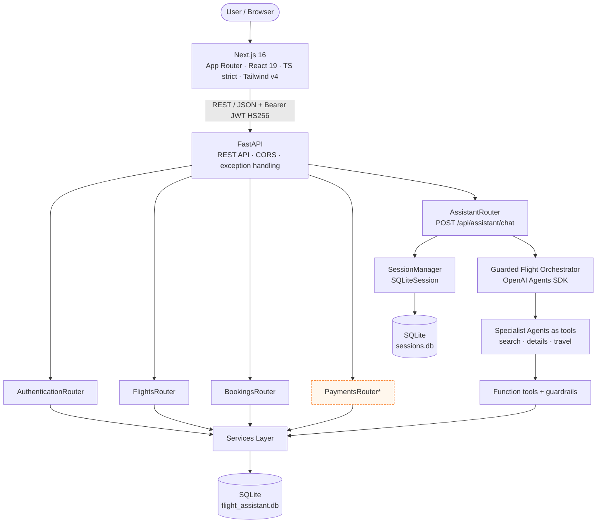
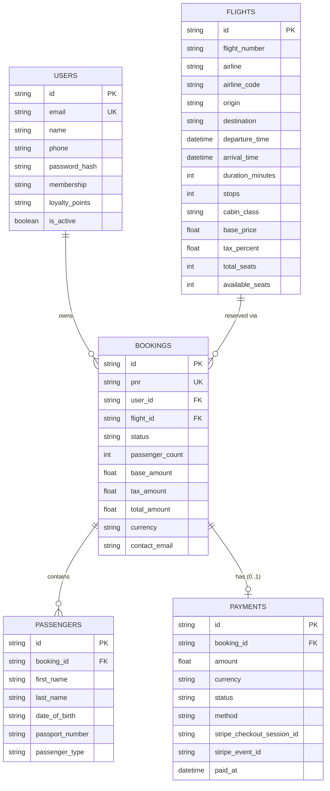
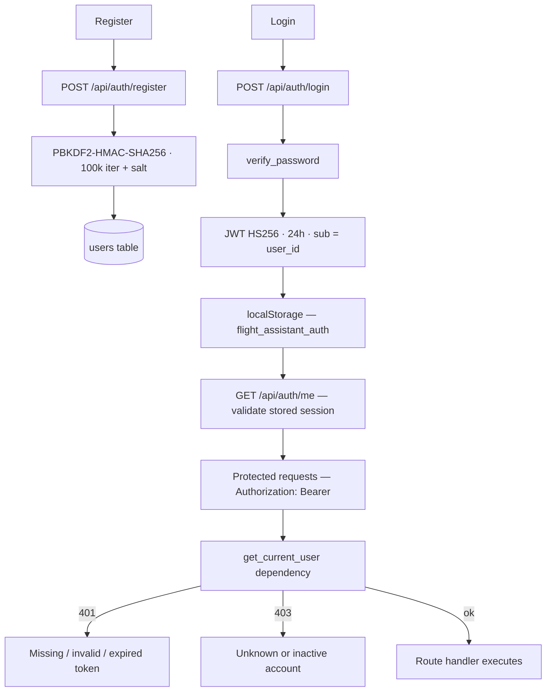
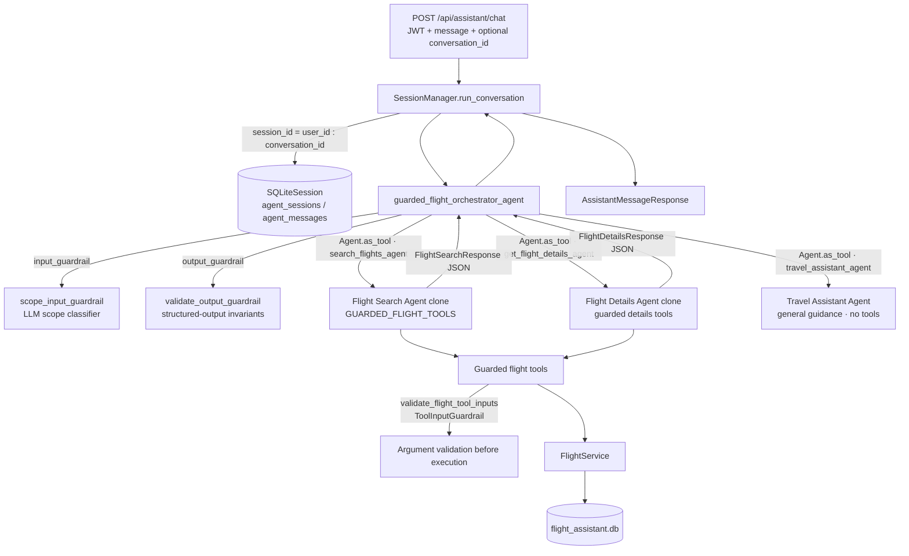
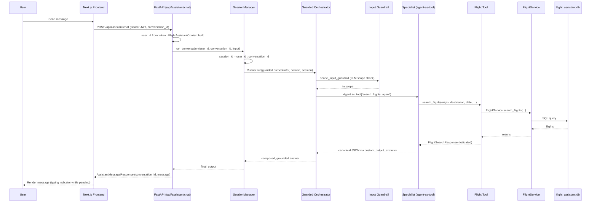
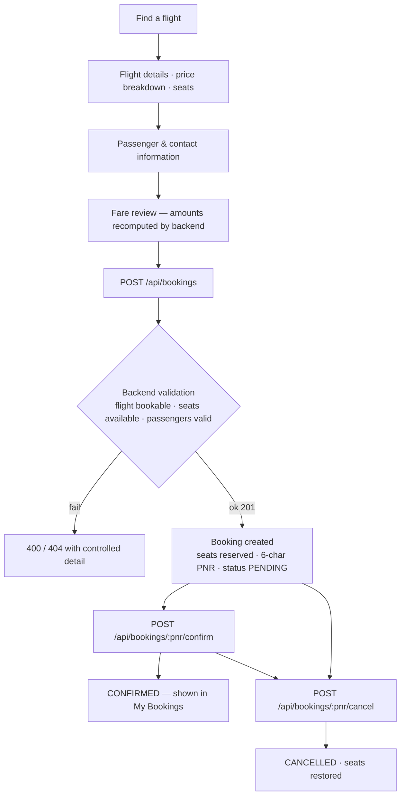

# Flight Assistant AI

> A full-stack AI flight booking platform: `Next.js` frontend, `FastAPI` backend, and a conversational travel assistant built on the OpenAI Agents SDK (powered by Gemini or Groq).

Flight Assistant AI is a complete, portfolio-ready full-stack product that demonstrates how a modern agentic-AI stack fits into a real application. Users register and log in (JWT), search seeded flight data between Pakistani-origin international routes, compare options with filters and sorting, view server-computed pricing and live seat availability, complete a booking flow (`PENDING` → `CONFIRMED`) with a backend-generated PNR, manage and cancel reservations, and chat with an AI assistant that remembers the conversation.

All authoritative values — price, tax, totals, PNR, seat availability, booking status, and ownership — come **exclusively from the backend**. The frontend never supplies user IDs, totals, PNRs, or statuses.

---

## Author

**Muhammad Bilal Hussain**

**Full-Stack Engineer · Agentic AI Engineer · AI Engineer**

Portfolio: **https://bilalfore.vercel.app**

---

## Table of Contents

- [Flight Assistant AI](#flight-assistant-ai)
  - [Author](#author)
  - [Table of Contents](#table-of-contents)
  - [Key Features](#key-features)
    - [Flight Discovery](#flight-discovery)
    - [Booking](#booking)
    - [Authentication](#authentication)
    - [AI Assistant](#ai-assistant)
    - [Engineering](#engineering)
  - [System Architecture](#system-architecture)
  - [Data Flow](#data-flow)
    - [Transactional (REST) path](#transactional-rest-path)
    - [AI path](#ai-path)
  - [Database Architecture](#database-architecture)
  - [Authentication \& Security](#authentication--security)
    - [Authentication Workflow](#authentication-workflow)
  - [AI / Agentic AI Architecture](#ai--agentic-ai-architecture)
    - [Agent Architecture](#agent-architecture)
    - [Agent Inventory](#agent-inventory)
    - [AI Tools](#ai-tools)
    - [Guardrails](#guardrails)
    - [Sessions \& Conversation Memory](#sessions--conversation-memory)
  - [Workflows](#workflows)
    - [AI Request Workflow](#ai-request-workflow)
    - [Flight Search Workflow](#flight-search-workflow)
    - [Booking Workflow](#booking-workflow)
  - [Frontend](#frontend)
    - [Frontend Routes](#frontend-routes)
  - [Backend](#backend)
  - [API Reference](#api-reference)
    - [System](#system)
    - [Authentication](#authentication-1)
    - [Flights](#flights)
    - [Bookings](#bookings)
    - [Payments *(optional Stripe module; 503 when unconfigured)*](#payments-optional-stripe-module-503-when-unconfigured)
    - [AI Assistant](#ai-assistant-1)
  - [Technology Stack](#technology-stack)
  - [Project Structure](#project-structure)
  - [Getting Started](#getting-started)
    - [1. Backend](#1-backend)
    - [2. Seed the demo database (idempotent)](#2-seed-the-demo-database-idempotent)
    - [3. Run the backend](#3-run-the-backend)
    - [4. Frontend](#4-frontend)
  - [Environment Variables](#environment-variables)
    - [Frontend (`frontend/.env.local` — public, non-secret)](#frontend-frontendenvlocal--public-non-secret)
    - [Backend (`backend/.env` — copy from `.env.example`, never commit `.env`)](#backend-backendenv--copy-from-envexample-never-commit-env)
  - [Testing](#testing)
    - [Backend (standalone scripts)](#backend-standalone-scripts)
    - [Frontend](#frontend-1)
  - [Security](#security)
  - [Current Status](#current-status)
    - [Not in scope](#not-in-scope)
  - [Future Improvements](#future-improvements)
  - [License](#license)

---

## Key Features

### Flight Discovery

- **Flight search** — origin/destination IATA codes, swap, travel date, cabin class, and passenger count with validation.
- **Filtering & sorting** — airline, max stops, price range, time of day; sort by price, departure, or duration.
- **Flight details** — route, schedule, duration, stops, aircraft, cabin, live seat availability, and a server-authoritative price breakdown (base + tax, USD).

### Booking

- **Complete booking flow** — passenger and contact input, fare review with backend-computed amounts, then create + confirm.
- **PNR & booking management** — a real state machine (`PENDING` → `CONFIRMED`, or `CANCELLED`) with a backend-generated, non-predictable 6-character PNR. Seats are reserved at booking creation and released on cancellation.
- **My Bookings** — reservation list with status badges, flight info, passengers, totals, and dates.

### Authentication

- **JWT registration/login/logout** — protected routes, session persistence, and 401 handling.

### AI Assistant

- **Conversational travel assistant** on `/assistant` — searches flights, compares options, and answers travel questions with a typing indicator, suggestion chips, retry, and per-session conversation memory.
- **OpenAI Agents SDK**: agents, `function_tool`s, `Agent.as_tool()` composition, input/output/tool guardrails, and `SQLiteSession` conversation memory.
- **Provider-agnostic LLM setup** — Gemini by default, Groq optional — driven by `config/model_config.py`.
- **REST-first design** — the AI layer is one endpoint (`POST /api/assistant/chat`); all transactional operations run through the typed REST API, not through raw model calls.

### Engineering

- **FastAPI backend** with `SQLAlchemy 2` async, Pydantic v2 validation, and a typed services layer.
- **Next.js 16 + React 19 + TypeScript (strict) + Tailwind CSS v4** frontend with separate per-domain API modules.
- **Polished UI states** — every transactional screen has loading, empty, error, and retry states; responsive across 390 / 768 / 1440.
- **Testing** — standalone backend verification suites plus a frontend end-to-end harness (Node + Chrome DevTools Protocol).

> Note: payments are **not** wired into the UI. Booking confirmation completes without payment. A Stripe payment module exists in the backend as an **optional** MVP integration.

---

## System Architecture



The demo dataset is generated by `backend/database/seed.py` (7 airlines across 8 routes, e.g. `KHI→DXB`, `LHE→DXB`, `ISB→DOH`, `KHI→IST`, plus one domestic route). `seed_database()` skips automatically when the `flights` table already has rows, so it never wipes data on restart.

---

## Data Flow

### Transactional (REST) path

```text
Frontend (lib/api modules)
   ↓  /api/...  (Bearer JWT)
FastAPI routers (api/)
   ↓
Pydantic schemas (schemas/)         — request validation & response contracts
   ↓
Services (services/)                — authoritative business logic
   ↓
SQLAlchemy ORM models (models/)
   ↓
Database (SQLite — flight_assistant.db)
```

### AI path

```text
Chat UI (AssistantExperience)
   ↓  POST /api/assistant/chat
AssistantRouter
   ↓
SessionManager.run_conversation()   — scoped persistent session
   ↓
Guarded Flight Orchestrator Agent
   ↓  Agent.as_tool()
Specialist agents (search / details / travel)
   ↓  function tools
FlightService / BookingService / tools
   ↓
Database (flight_assistant.db) and session store (sessions.db)
```

Every flight fact an agent states must originate from a tool result — tools are the only bridge between the AI layer and the database.

---

## Database Architecture

SQLite (single file, via SQLAlchemy 2 async + `aiosqlite`) stores the operational data. Tables are created automatically by `init_db()` at application startup (`create_all`); see `models/__init__.py` for the full ORM set.

| Model | Purpose | Key fields | Notes |
| --- | --- | --- | --- |
| `User` | Registered account | email (unique), name, phone, PBKDF2 password hash, membership tier, loyalty points, active flag | Owns bookings |
| `Flight` | Seeded schedule + pricing | flight number, airline(±IATA code), route IATA, cities/countries, schedule, duration, stops, cabin, base price, tax %, baggage, seat counts, aircraft, status | `total_price` computed property; check constraints on seats / price / stops |
| `Booking` | Reservation record | PNR (unique), status (`PENDING`/`CONFIRMED`/`CANCELLED`), passenger count, server-locked price snapshot, contact info, cancellation metadata | Owned by one user, bound to one flight |
| `Passenger` | Per-passenger details under a booking | names, date of birth, passport, nationality, type, seat/meal/special-assistance | 1-N under a booking (cascade delete) |
| `Payment` | (Optional) Stripe payment record | amount, currency, method, status, Stripe session/intent/charge/event ids, card last four | 1 booking : ≤1 payment; `stripe_event_id` for idempotency |

Agent conversation history lives in a **separate** store — `sessions.db` (`agent_sessions` / `agent_messages`, keyed by `session_id = "{user_id}:{conversation_id}"`) — so AI memory is scoped per user and conversation and can be cleared without touching operational data.



---

## Authentication & Security

Authentication is implemented end-to-end in `services/auth_service.py`, `dependencies/auth.py`, and the `(auth)` / `(app)` frontend route groups.

- **Registration** — `POST /api/auth/register` validates email uniqueness, hashes the password, and returns the created user profile. The frontend signs the new account in by immediately calling `/api/auth/login`.
- **Password handling** — PBKDF2-HMAC-SHA256 with a per-user random 16-byte salt and 100,000 iterations, stored as `salt$hash`. Plain-text passwords never touch the database.
- **Login — JWT tokens** — `POST /api/auth/login` issues a **HS256 JWT** (24-hour expiry, `sub` = user id) signed with `JWT_SECRET_KEY` from the environment.
- **Protected routes** — every protected endpoint requires `Authorization: Bearer <token>` through the `get_current_user` dependency. It raises **401** for missing/invalid/expired tokens and **403** for unknown or inactive accounts. `get_optional_user` supports a permissive variant.
- **Ownership enforcement** — bookings are only readable/confirmable/cancellable by their owning user.
- **Server-authoritative data** — prices, taxes, totals, PNRs, and statuses are computed in `services/` — never accepted from the client; the client `user_id` cannot be spoofed.
- **CORS** — allowlist configured via `ALLOWED_ORIGINS` (comma-separated; default `http://localhost:3000`).
- **Controlled error responses** — FastAPI exception handlers return sanitized JSON and never leak stack traces or internals.
- **Sessions** — the frontend persists the authenticated session in `localStorage` (`flight_assistant_auth`) and revalidates it against `GET /api/auth/me`; a 403 renders a blocked-account screen.
- **Validation** — Pydantic v2 schemas enforce request shapes (e.g., 3-letter IATA codes, non-empty passenger lists, `ge=1` passenger counts).

### Authentication Workflow



---

## AI / Agentic AI Architecture

`POST /api/assistant/chat` is the primary AI endpoint. Requests are authenticated, then handled per user session:



**Design intent:** the **orchestrator retains control** and delegates through tool calls (agents-as-tools) rather than handing off control. Each specialist runs as a nested `Runner.run` whose structured output is serialized to canonical JSON via a `custom_output_extractor`, so the orchestrator composes answers only from real tool data and never recomputes or "improves" values.

The flight specialists are **guardrail-aware clones** — the orchestrator constructs new agent instances whose flight tools are wrapped by `validate_flight_tool_inputs`, so tool argument validation applies even when the specialists are invoked as sub-agents.

### Agent Architecture

- **Handoffs vs. agent tools.** The production flow uses `Agent.as_tool()` — the orchestrator calls a specialist as a tool and keeps control (`result.last_agent` stays the orchestrator, which can call multiple specialists per turn). The `flight_triage_agent` demonstrates the alternative **handoff** pattern (control transfers to the specialist) and is a standalone reference, not wired into the API.
- **Shared context.** A single `FlightAssistantContext` dataclass — `user_id`, `user_name`, `user_email`, `user_phone`, `origin_preference`, `destination_preference`, `cabin_preference`, `preferred_cabin_class`, `preferred_currency`, `preferred_airline`, `trip_type` — is threaded through the runner to every specialist and tool. It is preferences-only; explicit user requests always win, and never a source of flight facts.
- **Structured outputs.** The search and details specialists declare Pydantic `output_type`s (`FlightSearchResponse`, `FlightDetailsResponse`) that enforce a grounding contract: every flight originates from a tool result, empty results are explicit, and no fabrication is allowed.

### Agent Inventory

| Agent | Module | Responsibility | Wired into `/api/assistant/chat`? |
| --- | --- | --- | --- |
| `guarded_flight_orchestrator_agent` | `app_agents/guarded_flight_orchestrator_agent.py` | Production-facing orchestrator with input, output, and tool guardrails; delegates to the three specialists as agent-tools | ✅ Yes (via `SessionManager`) |
| `flight_search_agent` | `app_agents/flight_search_agent.py` | Specialist: search / compare / price / seat-availability; declares `FlightSearchResponse` | ✅ Only as a guarded tool inside the orchestrator |
| `flight_details_agent` | `app_agents/flight_details_agent.py` | Specialist: single-flight lookup by flight number or id; declares `FlightDetailsResponse` | ✅ Only as a guarded tool inside the orchestrator |
| `travel_assistant_agent` | `app_agents/travel_assistant_agent.py` | General travel guidance (terminology, prep, comparisons) — no tools, no database | ✅ As a tool inside the orchestrator |
| `flight_triage_agent` | `app_agents/flight_triage_agent.py` | Multi-agent hub that routes via handoffs (`tool_choice="required"`) | ❌ Standalone demo — handoff routing |
| `flight_orchestrator_agent` | `app_agents/flight_orchestrator_agent.py` | Baseline orchestrator (agents-as-tools, unguarded) — reference for the guarded variant | ❌ Reference only |
| `booking_agent` | `app_agents/booking_agent.py` | Standalone booking agent built on the booking tools | ❌ Standalone demo |

The legacy/demo agents are kept for learning and comparison. Production booking does **not** go through an agent — it runs through the typed, authenticated Bookings REST API, which guarantees ownership and seat handling.

### AI Tools

| Tool | Purpose | Data / Service interaction | Notes |
| --- | --- | --- | --- |
| `search_flights` | Search flights by route, date, cabin | `FlightService.search_flights` → `flights` table | Tool-input guarded |
| `filter_flights` | Advanced filters (stops, airline, price range, time of day) | `FlightService.filter_flights` | Tool-input guarded |
| `get_flight_details` | Details of one flight by internal id | `FlightService.get_flight_details` | Tool-input guarded |
| `find_flight_by_number` | Look up a flight by human-facing number (e.g. `EK-601`) | `FlightService.get_flight_by_number` | Tool-input guarded |
| `compare_flights` | Compare multiple flights by id | `FlightService.compare_flights` | Tool-input guarded |
| `calculate_flight_price` | Server-side per-person / grand-total price | `FlightService.calculate_flight_price` | Tool-input guarded |
| `check_seat_availability` | Live seat check for N seats | `FlightService.check_seat_availability` | Tool-input guarded |
| `create_booking` / `confirm_booking` / `get_booking` / `list_user_bookings` / `cancel_booking` | Todo: booking lifecycle for the standalone agent | `BookingService` | `booking_agent` demo only — not in the chat flow |
| `create_payment` / `get_payment_status` | Optional Stripe checkout / status | `PaymentService` | Reference tools — optional, not in the chat flow |

### Guardrails

| Guardrail | Type | Purpose |
| --- | --- | --- |
| `scope_input_guardrail` | Input (LLM classifier) | Runs before the orchestrator starts; rejects clearly out-of-scope requests (coding, creative writing, unrelated topics). Ambiguous travel requests are allowed — the agent asks for clarification. Fails **open** on classifier error so a network/quota failure never breaks the system |
| `validate_output_guardrail` | Output | Validates structured-output invariants before a response is returned — `total_results` matches the returned list, `cheapest/fastest_flight_id` refer to returned flights (or are null) when none exist, prices are non-negative, and `FlightDetailsResponse` success/flight consistency holds |
| `validate_flight_tool_inputs` | Tool input | Validates function-call arguments on every guarded flight tool before execution — required origin/destination, `origin != destination`, `YYYY-MM-DD` dates, non-negative prices/stops, sensible passenger/seat counts, and flight id/number presence |

Guardrails are an additional safety layer; they short-circuit obviously invalid calls but never replace `FlightService` business rules or database validation.

### Sessions & Conversation Memory

- **Storage** — the Agents SDK `SQLiteSession` persists conversation history to **`sessions.db`** in the `agent_sessions` / `agent_messages` tables (path from `SESSION_DB_PATH`).
- **Session identifier** — `SessionManager` derives `session_id = "{user_id}:{conversation_id}"`, isolating memory per user and per conversation. The first message auto-generates a `conversation_id`; the frontend sends it back on every subsequent message.
- **Context propagation** — `FlightAssistantContext` (user identity and travel preferences) is passed into `Runner.run(...)` so agents and tools observe the same context object throughout a turn.
- **Scope** — this is per-conversation conversation memory, persisted server-side; clearing it removes only the user's chat sessions, never operational data.

---

## Workflows

### AI Request Workflow



### Flight Search Workflow

The core search experience runs through the typed REST API, not the AI layer. The assistant additionally reaches the same services through guarded agent tools.

```mermaid
flowchart TD
    U[User] --> FORM[SearchForm / FlightSearchBoard]
    FORM -->|origin · destination · date · cabin · passengers| CTX[SearchProvider]
    CTX --> SRCH[POST /api/flights/search<br/>Bearer JWT]
    SRCH --> SERVICE[FlightService.search_flights]
    SERVICE --> DB[(flights table)]

    DB --> RESP[FlightResponse[]]
    RESP --> POST[Client-side sort + FlightFilters]
    POST --> FILTER[POST /api/flights/filter<br/>airline · stops · price · time-of-day]
    FILTER --> CARDS[FlightCard results]

    CARDS --> DETAIL[GET /api/flights/:flightId<br/>flight details]
    CARDS --> SEATS[GET /api/flights/:flightId/seats<br/>live availability]
    CARDS --> PRICE[POST /api/flights/price<br/>server-computed breakdown]
    DETAIL --> BOOK[Proceed to booking]
```

### Booking Workflow



Booking confirmation completes without payment. With the optional Stripe module enabled, a booking can instead be confirmed after a verified `charge.succeeded` webhook event.

---

## Frontend

A single-page-feel app with App Router route groups: `(auth)` is public, `(app)` is gated by `ProtectedRoute` (redirects to `/login?next=…`, renders a blocked-account screen on 403) and wrapped in a `SearchProvider` so filters/sort survive navigation.

- **Next.js 16 App Router**, React 19, TypeScript (strict), Tailwind CSS v4 (see `frontend/package.json`).
- **API access is centralized** in `lib/api/` — typed per-domain modules over one `apiFetch` client with Bearer-token injection, 401/403 handling, and normalized `ApiError`s (field-level 422 mapping included).
- **Auth session** persists to `localStorage` under `flight_assistant_auth` and is revalidated against `GET /api/auth/me` on load.
- **Search state** (`SearchProvider`) keeps the last query and results in memory across navigation; **assistant state** (`AssistantProvider`) serializes turns and manages the `conversation_id` returned by the backend.
- The only frontend config value is `NEXT_PUBLIC_API_URL` (public, non-secret).
- Loading / empty / error / retry states are implemented for every transactional screen, and the app is responsive across 390 / 768 / 1440.

### Frontend Routes

| Route | Purpose |
| --- | --- |
| `/` | Public landing page — features, search preview, live system status |
| `/login` | Log in (supports `?next=…` return path) |
| `/register` | Create an account (auto-signs the user in) |
| `/flights/search` | Flight search + results with filters, sorting, and seat references |
| `/flights/[flightId]` | Flight details + server-computed price breakdown + seat availability |
| `/bookings/new/[flightId]` | Passenger/contact entry + fare review → create + confirm |
| `/bookings` | My Bookings — status badges, cancellation |
| `/bookings/[pnr]` | Booking detail — cancel dialog, double-submit guard |
| `/assistant` | AI travel assistant chat UI |
| `/profile` | Account information |

`/flights/search`, `/flights/[flightId]`, `/bookings/*`, `/assistant`, and `/profile` belong to the protected `(app)` group and require a valid session.

---

## Backend

The backend is a FastAPI application (`backend/main.py`) with a lifespan that initializes the database, CORS, controlled exception handling, and six routers:

| Directory | Responsibility |
| --- | --- |
| `api/` | FastAPI routers — auth, flights, bookings, payments, assistant, and the Stripe webhook |
| `services/` | Business logic — `AuthenticationService`, `FlightService`, `BookingService`, `PaymentService` |
| `schemas/` | Pydantic v2 request/response models (plus agent-facing response contracts in `models/responses.py`) |
| `models/` | SQLAlchemy ORM — `User`, `Flight`, `Booking`, `Passenger`, `Payment`, and `FlightAssistantContext` |
| `database/` | Async engine/session (aiosqlite), `init_db()`, idempotent seed (153 flights · 3 demo users), `run_init_seed` |
| `dependencies/` | `get_current_user` (required auth) and `get_optional_user` (optional auth) JWT dependencies |
| `config/` | `settings.py` (python-decouple) + `model_config.py` (Gemini / Groq model factory) |
| `guardrails/` | Input / output / tool guardrails for the AI layer |
| `app_agents/` | OpenAI Agents SDK agents and orchestration |
| `sessions/` | `SessionManager` + `SQLiteSession` wiring |
| `tools/` | `@function_tool` wrappers (flight, details, guarded, booking, payment) |

See [System Architecture](#system-architecture) and the [API Reference](#api-reference) below for behavior details.

---

## API Reference

All routes live in `backend/api/`. Interactive docs are served by FastAPI at **http://127.0.0.1:8000/docs** (ReDoc at `/redoc`); the raw schema is available at **http://127.0.0.1:8000/openapi.json**. Public endpoints: service info, health, register, login, and the webhook.

### System

| Method | Endpoint | Auth | Description |
| --- | --- | --- | --- |
| `GET` | `/` | – | Service info — name, version, status, docs/health links |
| `GET` | `/api/health` | – | Health check — `status`, `app`, `version`, `ai_provider`, `model` |

### Authentication

| Method | Endpoint | Auth | Description |
| --- | --- | --- | --- |
| `POST` | `/api/auth/register` | – | Create account (201; returns user profile) |
| `POST` | `/api/auth/login` | – | Login — returns JWT + user |
| `GET` | `/api/auth/me` | ✅ | Current user profile — membership, loyalty, timestamps |

### Flights

| Method | Endpoint | Auth | Description |
| --- | --- | --- | --- |
| `POST` | `/api/flights/search` | ✅ | Search by origin/destination/date/cabin — full-bodied `FlightSearchRequest` |
| `GET` | `/api/flights/{flight_id}` | ✅ | Flight details by id |
| `POST` | `/api/flights/filter` | ✅ | Advanced filter — airline, stops, price range, time of day |
| `POST` | `/api/flights/price?flight_id=&passenger_count=` | ✅ | Server-computed price breakdown for N passengers |
| `GET` | `/api/flights/{flight_id}/seats` | ✅ | Live seat availability |

### Bookings

| Method | Endpoint | Auth | Description |
| --- | --- | --- | --- |
| `POST` | `/api/bookings` | ✅ | Create booking (201) — seats reserved, PNR returned, `PENDING` |
| `GET` | `/api/bookings` | ✅ | List the authenticated user's bookings |
| `GET` | `/api/bookings/{pnr}` | ✅ | Booking detail (ownership enforced — 403 cross-user) |
| `POST` | `/api/bookings/{pnr}/confirm` | ✅ | `PENDING` → `CONFIRMED` (ownership enforced) |
| `POST` | `/api/bookings/{pnr}/cancel` | ✅ | `CANCELLED` + seats released (ownership enforced) |

### Payments *(optional Stripe module; 503 when unconfigured)*

| Method | Endpoint | Auth | Description |
| --- | --- | --- | --- |
| `POST` | `/api/payments/checkout` | ✅ | Create a Stripe Checkout Session for a booking |
| `GET` | `/api/payments/{booking_id}/status` | ✅ | Payment status lookup (ownership enforced) |
| `POST` | `/api/payments/webhook` | – | Stripe webhook — signature-verified, idempotent on `stripe_event_id` |

### AI Assistant

| Method | Endpoint | Auth | Description |
| --- | --- | --- | --- |
| `POST` | `/api/assistant/chat` | ✅ | AI assistant chat — guarded orchestrator + session persistence |

---

## Technology Stack

| Layer | Technology |
| --- | --- |
| Frontend | Next.js 16 (App Router), React 19, TypeScript (`strict`), Tailwind CSS v4, ESLint |
| Backend | Python ≥ 3.12, FastAPI, Uvicorn, SQLAlchemy 2 (async), aiosqlite, Pydantic v2, python-decouple, PyJWT |
| AI | OpenAI Agents SDK (`openai-agents`), Gemini (Google AI Studio) or Groq via OpenAI-compatible endpoints |
| Auth | PBKDF2-HMAC-SHA256 password hashing, JWT (HS256, 24h) enforced by FastAPI dependencies |
| Payments | Stripe — optional, backend-only, disabled by default |
| Database | SQLite for development (`flight_assistant.db` + `sessions.db`); SQLAlchemy models are portable to PostgreSQL |
| Tooling | `uv` for Python dependencies, `npm` for the frontend |

---

## Project Structure

```
flight_assistant/
├── backend/
│   ├── api/              # FastAPI routers (auth, flights, bookings, payments, assistant, webhook)
│   ├── app_agents/       # OpenAI Agents SDK agents (guarded orchestrator, specialists, demos)
│   ├── config/           # environment settings + Gemini/Groq model factory
│   ├── database/         # async engine/session, init_db, idempotent seed (153 flights, 3 demo users)
│   ├── dependencies/     # get_current_user / get_optional_user JWT dependencies
│   ├── guardrails/       # input (scope) · output (invariants) · tool (argument) guardrails
│   ├── models/           # SQLAlchemy ORM (User, Flight, Booking, Passenger, Payment) + context
│   ├── schemas/          # Pydantic request/response models
│   ├── services/         # auth · flight · booking · payment business logic
│   ├── sessions/         # SessionManager + SQLiteSession conversation store
│   ├── tools/            # @function_tool wrappers (flight, details, guarded, booking, payment)
│   ├── tests/            # standalone verification scripts (see Testing)
│   ├── main.py           # FastAPI app — CORS, routers, exception handlers, lifespan
│   └── pyproject.toml    # uv project (requires-python >= 3.12)
│
├── frontend/
│   ├── app/              # App Router pages + (auth) / (app) route groups
│   ├── components/       # assistant · auth · bookings · feedback · flights · layout · profile · ui
│   ├── lib/              # API client, auth/assistant/search contexts, shared types & utils
│   ├── tests/            # E2E harness (Node + Chrome DevTools Protocol) + launcher
│   └── package.json      # Next.js 16 project
│
├── .gitignore
└── README.md
```

---

## Getting Started

Requirements: **Python ≥ 3.12**, [uv](https://docs.astral.sh/uv/), **Node.js ≥ 20** (recommended).

### 1. Backend

```powershell
cd flight_assistant\backend
uv sync
Copy-Item .env.example .env   # then edit .env (see Environment Variables)
```

Set at least a provider key — the default provider is Gemini:

```dotenv
GEMINI_API_KEY=your_gemini_api_key_here
```

Optionally switch to Groq:

```dotenv
DEFAULT_PROVIDER=groq
GROQ_API_KEY=your_groq_api_key_here
```

### 2. Seed the demo database (idempotent)

```powershell
uv run python -m database.run_init_seed
```

Creates all tables, inserts 153 mock flights and 3 demo users, and prints a sample of flights. `seed_database()` skips automatically when the `flights` table already has rows, so the seed never wipes data on restart.

### 3. Run the backend

```powershell
uv run uvicorn main:app --reload
```

- API docs: http://127.0.0.1:8000/docs
- Health: http://127.0.0.1:8000/api/health
- Service info: http://127.0.0.1:8000/

### 4. Frontend

```powershell
cd ..\frontend
npm install
Copy-Item .env.example .env.local   # optional — defaults to http://127.0.0.1:8000
npm run dev
```

Open http://localhost:3000 and register an account (registration signs you in automatically). Create your own account to exercise the full booking/assistant journey — the seeded demo users are reference data only.

---

## Environment Variables

### Frontend (`frontend/.env.local` — public, non-secret)

| Variable | Purpose | Secret |
| --- | --- | --- |
| `NEXT_PUBLIC_API_URL` | Backend base URL (default `http://127.0.0.1:8000`) | No |

The frontend contains **no** secrets.

### Backend (`backend/.env` — copy from `.env.example`, never commit `.env`)

| Variable | Purpose | Secret |
| --- | --- | --- |
| `APP_NAME` / `APP_VERSION` / `DEBUG` | Service metadata / debug mode | No |
| `ALLOWED_ORIGINS` | CORS allowlist (comma-separated; default `http://localhost:3000`) | No |
| `DATABASE_URL` | SQLAlchemy async URL (default `sqlite+aiosqlite:///./flight_assistant.db`) | No |
| `DEFAULT_PROVIDER` | `gemini` or `groq` | No |
| `GEMINI_API_KEY` | Gemini API key | ✅ Yes |
| `GEMINI_MODEL` | Gemini model name (e.g. `gemini-3.5-flash-lite`) | No |
| `GROQ_API_KEY` | Groq API key | ✅ Yes |
| `GROQ_BASE_URL` / `GROQ_MODEL` | Groq endpoint / model | No |
| `SESSION_DB_PATH` | Assistant conversation store (default `./sessions.db`) | No |
| `DISABLE_TRACING` | Toggle Agents SDK tracing | No |
| `JWT_SECRET_KEY` | Token signing secret (**has an insecure dev default — must be changed beyond local use**) | ✅ Yes |
| `JWT_EXPIRATION_HOURS` | Token lifetime (default 24) | No |
| `STRIPE_SECRET_KEY` / `STRIPE_PUBLISHABLE_KEY` / `STRIPE_WEBHOOK_SECRET` | Optional Stripe integration (leave blank to disable) | ✅ Yes |

`.env`, `.env.local`, databases (`*.db`), `node_modules/`, `.next/`, and `.venv/` are git-ignored.

---

## Testing

### Backend (standalone scripts)

Backend tests are intentionally **standalone scripts** — each has a `__main__` runner that prints `PASS`/`FAIL` counts — rather than a pytest-collected suite. Run them individually from `backend\`:

```powershell
uv run python tests/<script>.py
```

Coverage by file:

| Tests | What they verify |
| --- | --- |
| `test_phase_14_api.py` / `test_phase_14_http.py` | HTTP round-trip and API integration — endpoint behavior, request/response contracts, authentication, security |
| `test_flight_service.py` | Flight search, filter, price breakdown, seat availability |
| `test_booking_service.py` | Booking lifecycle, ownership enforcement, seat handling |
| `test_flight_tools.py` / `test_booking_tools.py` | Agent function-tool behavior |
| `test_payment_service.py` | Mocked Stripe checkout + webhook signature verification |
| `test_flight_search_agent.py` · `test_flight_orchestrator_agent.py` · `test_flight_triage_agent.py` · `test_booking_agent.py` | Agent-level suites — call the live LLM and therefore require a valid provider key; they skip or surface `429` when the free-tier quota is exhausted |
| `test_sessions.py` | Session manager / conversation persistence |
| `test_guardrails_smoke.py` | Guardrail behavior smoke checks (LLM-dependent where applicable) |

### Frontend

```powershell
npm run lint        # ESLint
npx tsc --noEmit    # TypeScript type check
npm run build       # production build
```

E2E harnesses live in `frontend/tests/` (Node + Chrome DevTools Protocol) and run the full application end-to-end against the running backend — auth, search, details, assistant, booking, bookings, cancellation, security, navigation, responsive, and quality checks. See `frontend/tests/` for the runnable harness and its launcher script.

---

## Security

- Passwords are hashed with **PBKDF2-HMAC-SHA256** (100,000 iterations, per-user random salt) before storage — plain-text passwords never touch the DB.
- Tokens are **HS256 JWTs** with 24h expiry; every protected endpoint requires `Authorization: Bearer <token>` via `get_current_user`.
- `get_current_user` raises `401` for missing/invalid tokens and `403` for unknown or inactive accounts.
- **Ownership enforcement** — bookings are only readable/confirmable/cancellable by their owning user.
- **Server-authoritative data** — prices, taxes, totals, PNRs, and statuses are computed in `services/` and never accepted from the client; the client `user_id` cannot be spoofed.
- **Controlled errors** — FastAPI exception handlers return sanitized JSON; nothing internal is leaked to clients.
- **Stripe webhook** — signature-verified and idempotent on `stripe_event_id`; the module is inert (`503`) unless configured.
- **AI guardrails** — the assistant is guarded at input (scope), output (invariants), and tool (argument validation) boundaries; tool access is limited to the seeded data model.
- **No secrets in the repository** — keys live only in `.env` files which are git-ignored.

---

## Current Status

Completed, self-contained full-stack project: backend (agents, tools, guardrails, session memory, REST API), integrated Next.js frontend, and end-to-end verification all in place.

- **Demo data** — 153 mock flights from `database/seed.py` across 8 Pakistani-origin routes and 7 airlines; replace `seed.py` with a real flight-API integration for production use.
- **Payments** — optional backend-only Stripe module; no checkout UI; booking works without payment.
- **Concurrency model** — SQLite single-file DB is development-grade; the SQLAlchemy models migrate to PostgreSQL.
- **AI integration** — the guarded agentic flow is wired to `POST /api/assistant/chat`; the handoff/triage and booking-agent flows ship as standalone reference demos for comparison.
- **Portfolio scope** — a well-tested local MVP, **not deployed** and **not production-hardened** (e.g., dev JWT default, single-user workflow focus).

### Not in scope

- Real-time flight feeds / dynamic pricing (seeded static dataset).
- In-app payment UX, email receipts, or an admin/ops console.
- Multi-tenant / enterprise auth (OAuth, refresh-token rotation).

---

## Future Improvements

Reasonable extensions, presented as future possibilities rather than existing features:

- Production **PostgreSQL** deployment.
- Real airline / GDS / **flight-API integration** to replace the seeded dataset.
- Advanced **payment integration** (checkout UI, receipts, full Stripe lifecycle wired into the frontend).
- **Observability** — structured logging, metrics, and tracing in production.
- **CI/CD** pipeline with automated backend and frontend gates.
- Broader **automated testing** — a collected pytest suite and contract tests.

---

## License

This project is licensed under the MIT License.

See the [LICENSE](LICENSE) file for the complete license text.

---

**Muhammad Bilal Hussain** — Full-Stack Engineer · Agentic AI Engineer · AI Engineer — https://bilalforge.vercel.app